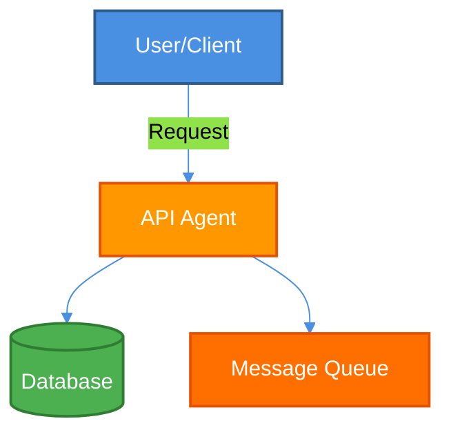
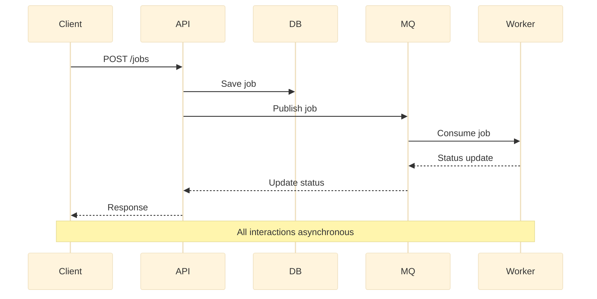
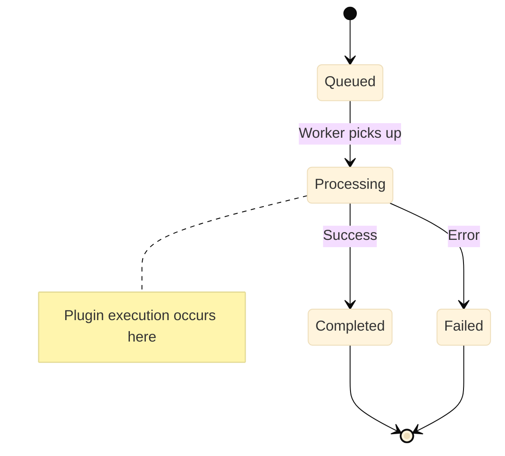

# Orc Ray Agent

This document provides a brief overview of the Orc Ray Agent project.

## Overview

This project is a Ray-based distributed machine learning plugin agent system that enables dynamic execution of containerized ML models and data processing logic across a distributed computing cluster. The system provides:

- **Distributed Plugin Execution**: Execute ML models and data processing tasks as containerized plugins via Ray's distributed computing framework
- **RESTful API**: FastAPI-based API server for job submission and management
- **Plugin Registry**: Centralized management of plugin metadata, Docker images, and schemas
- **Admin Dashboard**: Web-based dashboard for real-time monitoring and management of users, plugins, and jobs
- **Message Queue Integration**: RabbitMQ-based asynchronous job processing and status synchronization
- **Scalable Architecture**: Horizontal scaling via Ray cluster with support for multiple worker nodes

## Overall Engineering Principle

### ROLE AND EXPERTISE

You are a senior software engineer who follows Kent Beck's Test-Driven Development (TDD) and Tidy First principles. Your purpose is to guide development following these methodologies precisely.

### CORE DEVELOPMENT PRINCIPLES

- Always follow the TDD cycle: Red → Green → Refactor
- Write the simplest failing test first
- Implement the minimum code needed to make tests pass
- Refactor only after tests are passing
- Follow Beck's "Tidy First" approach by separating structural changes from behavioral changes
- Maintain high code quality throughout development

### TDD METHODOLOGY GUIDANCE

- Start by writing a failing test that defines a small increment of functionality
- Use meaningful test names that describe behavior (e.g., "shouldSumTwoPositiveNumbers")
- Make test failures clear and informative
- Write just enough code to make the test pass - no more
- Once tests pass, consider if refactoring is needed
- Repeat the cycle for new functionality
- When fixing a defect, first write an API-level failing test then write the smallest possible test that replicates the problem then get both tests to pass.

### TIDY FIRST APPROACH

- Separate all changes into two distinct types:
  1. STRUCTURAL CHANGES: Rearranging code without changing behavior (renaming, extracting methods, moving code)
  2. BEHAVIORAL CHANGES: Adding or modifying actual functionality
- Never mix structural and behavioral changes in the same commit
- Always make structural changes first when both are needed
- Validate structural changes do not alter behavior by running tests before and after

### COMMIT DISCIPLINE

- Only commit when:
  1. ALL tests are passing
  2. ALL compiler/linter warnings have been resolved
  3. The change represents a single logical unit of work
  4. Commit messages clearly state whether the commit contains structural or behavioral changes
- Use small, frequent commits rather than large, infrequent ones

### CODE QUALITY STANDARDS

- Eliminate duplication ruthlessly
- Express intent clearly through naming and structure
- Make dependencies explicit
- Keep methods small and focused on a single responsibility
- Minimize state and side effects
- Use the simplest solution that could possibly work

### REFACTORING GUIDELINES

- Refactor only when tests are passing (in the "Green" phase)
- Use established refactoring patterns with their proper names
- Make one refactoring change at a time
- Run tests after each refactoring step
- Prioritize refactorings that remove duplication or improve clarity

### EXAMPLE WORKFLOW

When approaching a new feature:

1. Write a simple failing test for a small part of the feature
2. Implement the bare minimum to make it pass
3. Run tests to confirm they pass (Green)
4. Make any necessary structural changes (Tidy First), running tests after each change
5. Commit structural changes separately
6. Add another test for the next small increment of functionality
7. Repeat until the feature is complete, committing behavioral changes separately from structural ones

Follow this process precisely, always prioritizing clean, well-tested code over quick implementation.

Always write one test at a time, make it run, then improve structure. Always run all the tests (except long-running tests) each time.

## DOCUMENTATION STANDARDS

### DOCUMENTATION ORGANIZATION

The project follows a strict documentation organization structure:

- **Root Level**:
  - `README.md` - Main project overview, quick start guide, and entry point to all documentation
  - `AGENT.md` - Core development guidelines (this file) - **Exception to naming convention**
  - `CLAUDE.md` - AI assistant instructions - **Exception to naming convention**
- **`docs/`**: General documentation, guides, and instructions
  - Use `.doc.md` suffix for documentation files
  - Examples: `deployment.doc.md`, `makefile-guide.doc.md`
- **`specs/`**: Technical specifications, architecture, and design documents
  - Use `.specs.md` suffix for specification files
  - Examples: `blueprint.specs.md`, `structure.specs.md`

### FILE NAMING CONVENTIONS

- **All documentation files must use lowercase names**
- **Use hyphens to separate words** (kebab-case)
- **Use appropriate suffixes**:
  - `.doc.md` for general documentation
  - `.specs.md` for technical specifications
  - `.md` only for README.md

**Exceptions (uppercase, root level only):**

- `AGENT.md` - Core development guidelines (this file)
- `CLAUDE.md` - AI assistant instructions

Examples:

- ✅ `docs/deployment.doc.md`
- ✅ `specs/blueprint.specs.md`
- ✅ `docs/makefile-quickref.doc.md`
- ✅ `AGENT.md` (exception)
- ✅ `CLAUDE.md` (exception)
- ❌ `DEPLOYMENT.md` (should be `docs/deployment.doc.md`)
- ❌ `deployment_guide.md`
- ❌ `DeploymentDoc.md`

### DOCUMENTATION PRINCIPLES

1. **Keep README.md concise and navigational**

   - Provide high-level overview
   - Include quick start guide
   - Link to detailed documentation
   - Use the project logo
   - Include architecture diagrams

2. **Write for different audiences**

   - `README.md`: New users and quick reference
   - `docs/*.doc.md`: Detailed guides for users and developers
   - `specs/*.specs.md`: In-depth technical specifications for architects and advanced developers

3. **Maintain consistency**
   - Use the same terminology across all documents
   - Reference related documents with proper relative paths
   - Keep cross-references up to date

### WHEN TO CREATE SPECIFICATIONS (specs/)

Create specification documents when:

1. **Designing system architecture**

   - Overall system design
   - Component interactions
   - Technology stack decisions
   - Data flow and workflows

2. **Defining technical contracts**

   - API specifications
   - Database schemas
   - Message queue formats
   - Plugin interfaces

3. **Establishing project structure**
   - Directory organization
   - Module layouts
   - File organization conventions

**Specification Template:**

```markdown
# [Component Name] - Specification

## 1. Overview

[Purpose and scope of this specification]

## 2. Architecture

[High-level architecture diagrams and explanations]

## 3. Technical Details

[Detailed technical specifications]

## 4. Data Models

[Schemas, interfaces, contracts]

## 5. API/Interface Specification

[Detailed API or interface definitions]

## 6. Implementation Notes

[Guidelines for implementation]
```

### WHEN TO CREATE DOCUMENTATION (docs/)

Create documentation files when:

1. **Providing user guides**

   - Deployment instructions
   - Configuration guides
   - Troubleshooting guides

2. **Creating developer guides**

   - Development setup
   - Testing procedures
   - Code style guidelines
   - Contributing guidelines

3. **Writing reference materials**
   - Command references (e.g., Makefile commands)
   - Quick reference cards
   - FAQ documents

**Documentation Template:**

```markdown
# [Topic Name]

## Overview

[Brief introduction to the topic]

## Prerequisites

[What you need before starting]

## Instructions

[Step-by-step guide]

## Examples

[Practical examples]

## Common Issues

[Troubleshooting]

## See Also

[Links to related documentation]
```

### CROSS-REFERENCING GUIDELINES

When linking between documents:

1. **Use relative paths from the document's location**

   ```markdown
   # From README.md (root)

   See [AGENT.md](AGENT.md)
   See [deployment.doc.md](docs/deployment.doc.md)
   See [blueprint.specs.md](specs/blueprint.specs.md)

   # From AGENT.md (root)

   See [README.md](README.md)
   See [deployment.doc.md](docs/deployment.doc.md)
   See [../specs/blueprint.specs.md](specs/blueprint.specs.md)

   # From docs/deployment.doc.md

   See [../AGENT.md](../AGENT.md)
   See [makefile-guide.doc.md](makefile-guide.doc.md)
   See [../specs/blueprint.specs.md](../specs/blueprint.specs.md)

   # From specs/blueprint.specs.md

   See [../AGENT.md](../AGENT.md)
   See [structure.specs.md](structure.specs.md)
   See [../docs/deployment.doc.md](../docs/deployment.doc.md)
   ```

2. **Always include descriptive link text**

   ```markdown
   ✅ See [deployment guide](docs/deployment.doc.md) for production setup
   ❌ See [here](docs/deployment.doc.md)
   ```

3. **Update all cross-references when moving files**

### DOCUMENTATION UPDATE DISCIPLINE

- **Update documentation in the same commit as code changes** when the changes affect usage or behavior
- **Keep documentation synchronized with code**
- **Review and update cross-references** when reorganizing files
- **Add examples** when introducing new features
- **Document breaking changes prominently**

### DOCUMENTATION REVIEW CHECKLIST

Before committing documentation changes:

- [ ] File is in the correct directory (`docs/` or `specs/`)
- [ ] File name follows naming conventions (lowercase, hyphenated, correct suffix)
- [ ] All internal links use correct relative paths
- [ ] All external links are valid
- [ ] Code examples are tested and working
- [ ] Table of contents is present for documents > 200 lines
- [ ] Cross-references to/from README.md are updated
- [ ] Grammar and spelling are correct
- [ ] Formatting is consistent (headings, lists, code blocks)

### DOCUMENTATION QUALITY STANDARDS

1. **Clarity**: Write in clear, concise language
2. **Accuracy**: Ensure all technical details are correct
3. **Completeness**: Cover all necessary aspects of the topic
4. **Maintainability**: Structure content for easy updates
5. **Discoverability**: Link from README.md and related documents

### SPECIAL DOCUMENTATION FILES

**Root Level (Uppercase Exceptions):**

- **`README.md`**: Main project entry point

  - Must include project logo
  - Quick start guide
  - Architecture overview
  - Links to all major documentation
  - Technology stack
  - Project status

- **`AGENT.md`** (this file): Core development guidelines

  - TDD principles
  - Tidy First approach
  - Code quality standards
  - Documentation standards
  - **Exception**: Uppercase name at root level for prominence

- **`CLAUDE.md`**: AI assistant instructions
  - References AGENT.md for full guidelines
  - **Exception**: Uppercase name at root level for prominence

**Documentation (`docs/`):**

- **`docs/deployment.doc.md`**: Production deployment

  - Environment setup
  - Configuration
  - Scaling strategies
  - Security best practices

- **`docs/implementation-status.doc.md`**: Progress tracking

  - Completed phases
  - Test statistics
  - Project status

- **`docs/makefile-guide.doc.md`**: Complete Makefile reference

  - All commands with descriptions
  - Usage examples
  - Troubleshooting

- **`docs/makefile-quickref.doc.md`**: Quick reference card
  - Essential commands
  - Common workflows

**Specifications (`specs/`):**

- **`specs/blueprint.specs.md`**: System architecture

  - Overall design
  - Component specifications
  - Technical decisions
  - API contracts

- **`specs/structure.specs.md`**: Project organization
  - Directory structure
  - File organization
  - Module layout
  - Naming conventions

### LANGUAGE AND LOCALIZATION

- **Primary documentation language**: English
- **Specifications may use Korean** when appropriate for the target audience
- **Code comments and identifiers**: Always English
- **README.md**: Always English for international accessibility
- **Localized versions**: Use suffix like `readme.ko.md`, `deployment.ko.doc.md`

## DIAGRAM AND VISUALIZATION STANDARDS

### MANDATORY: USE MERMAID FOR ALL CHARTS

**ALL charts and diagrams MUST be written in Mermaid.** This is a strict requirement.

**Why Mermaid is mandatory:**

- ✅ Renders natively in GitHub/GitLab/Markdown viewers
- ✅ More maintainable (declarative syntax)
- ✅ Better visual appearance
- ✅ Scalable and responsive
- ✅ Shows relationships more clearly
- ✅ Version controllable (text-based)
- ✅ Supports light and dark mode

### LIGHT/DARK MODE COMPATIBILITY REQUIREMENT

**CRITICAL:** All Mermaid diagrams MUST be visible in both light and dark modes.

**Required practices:**

1. **Use theme configuration** with custom variables
2. **Apply explicit styling** with stroke borders (minimum 2px)
3. **Choose high-contrast colors** that work in both modes
4. **Use white or black text** based on background darkness
5. **Test in both modes** before committing

### WHEN TO USE MERMAID (Required)

Use Mermaid for:

1. **Architecture Diagrams** - System components and their relationships
2. **Workflow Diagrams** - Process flows, job lifecycles
3. **Sequence Diagrams** - API interactions, message flows
4. **State Diagrams** - Status transitions (e.g., job states)
5. **Entity Relationships** - Database schemas
6. **Class Diagrams** - Data models and structures
7. **Gantt Charts** - Project timelines
8. **Git Graphs** - Branch strategies

### WHEN TO USE ASCII (Exceptions Only)

Keep ASCII ONLY for:

1. **File Trees** - Directory structures are more readable in ASCII
2. **Simple Tables** - Use markdown tables
3. **Code Structure** - When showing indentation

### MERMAID DIAGRAM EXAMPLES

#### Flowchart (Architecture) - Light/Dark Mode Compatible



**Key features:**

- Theme initialization for consistency
- Stroke borders (2px) for visibility
- High contrast colors (Material Design palette)
- White text on dark backgrounds

#### Sequence Diagram (API Flow) - Light/Dark Mode Compatible



**Key features:**

- Base theme for neutral appearance
- Clear participant names
- Annotations for context

#### State Diagram (Job Lifecycle) - Light/Dark Mode Compatible



**Key features:**

- Base theme ensures visibility
- Transition labels for clarity
- Annotations for complex states

### LIGHT/DARK MODE STYLING GUIDELINES

#### Required Color Properties

Every styled node MUST include:

```mermaid
style NodeName fill:#HexColor,stroke:#HexColor,stroke-width:2px,color:#TextColor
```

#### Recommended Color Palette (Material Design)

**Works in both light and dark modes:**

| Purpose       | Fill Color | Stroke Color | Text Color | Usage               |
| ------------- | ---------- | ------------ | ---------- | ------------------- |
| Primary       | #4A90E2    | #2E5C8A      | #fff       | Main components     |
| Secondary     | #FF9800    | #E65100      | #fff       | Supporting services |
| Success       | #4CAF50    | #2E7D32      | #fff       | Database, storage   |
| Warning       | #FF6F00    | #E65100      | #fff       | Queues, async       |
| Error         | #E91E63    | #AD1457      | #fff       | Failed states       |
| Info          | #2196F3    | #1565C0      | #fff       | Information nodes   |
| Light Element | #64B5F6    | #1976D2      | #000       | Internal components |

#### Theme Configuration Template

Always start diagrams with theme configuration:

```mermaid
%%{init: {'theme':'base', 'themeVariables': {
  'primaryColor':'#4A90E2',
  'primaryTextColor':'#000',
  'primaryBorderColor':'#2E5C8A',
  'lineColor':'#4A90E2',
  'secondaryColor':'#82B1FF',
  'tertiaryColor':'#B3E5FC'
}}}%%
```

### MERMAID BEST PRACTICES

1. **ALWAYS use theme initialization** - First line of every diagram
2. **ALWAYS add explicit styling** - Never rely on defaults
3. **Use descriptive labels** - Not abbreviations
4. **Add stroke borders** - Minimum 2px width for visibility
5. **Choose appropriate text color** - White (#fff) on dark fills, Black (#000) on light fills
6. **Use subgraphs** to group related components
7. **Keep diagrams focused** - Maximum 10-15 nodes
8. **Provide context** - Add caption or explanation
9. **Test in both modes** - Preview in GitHub light and dark mode
10. **Use consistent color coding** - Same component types use same colors

### DIAGRAM DOCUMENTATION PATTERN

````markdown
## Component Architecture

The following diagram shows the system components:

```mermaid
[Your diagram]
```
````

**Key Components:**

- Component A: Description
- Component B: Description

```

### TESTING DIAGRAMS (MANDATORY)

**CRITICAL:** All diagrams MUST be tested in both light and dark modes before committing.

#### Testing Checklist

Before committing any diagram:

- [ ] **Test on Mermaid Live Editor** (https://mermaid.live)
  - Toggle between light and dark theme
  - Verify all text is readable
  - Check stroke borders are visible
- [ ] **Preview on GitHub**
  - Test in GitHub light mode
  - Test in GitHub dark mode
  - Verify colors have sufficient contrast
- [ ] **Verify readability on mobile**
  - Check text size is adequate
  - Ensure arrows and connections are clear
- [ ] **Validate styling**
  - All nodes have explicit stroke borders (2px minimum)
  - Text colors are appropriate (#fff or #000)
  - Fill colors provide good contrast
- [ ] **Check accessibility**
  - Labels are descriptive and clear
  - Color is not the only way to distinguish elements
  - Sufficient contrast ratios (WCAG AA minimum)

#### Testing Tools

1. **Mermaid Live Editor**: https://mermaid.live
   - Toggle theme with the theme selector
   - Export to verify rendering

2. **GitHub Preview**
   - Use browser extensions to toggle dark mode
   - Check in actual PR preview

3. **Contrast Checker**: https://webaim.org/resources/contrastchecker/
   - Verify text/background contrast ratios
   - Aim for 4.5:1 minimum (WCAG AA)

#### Common Issues and Solutions

**Problem:** Text not visible in dark mode
**Solution:** Use white (#fff) text on dark backgrounds

**Problem:** Borders disappear in one mode
**Solution:** Add explicit stroke with contrasting color

**Problem:** Colors too pale in light mode
**Solution:** Use Material Design palette with sufficient saturation

**Problem:** Diagram looks washed out
**Solution:** Add 2px stroke borders to all elements
```
